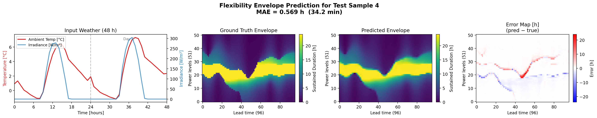

# **Machine Learning-Assisted Large Scale Quantification of Building Energy Flexibility**
**MAGNIFY: Data-Driven Demand-Side Flexibility Quantification**

---

## **Project Overview**
This repository provides a complete computational framework to **quantify and predict building demand-side flexibility**. It unifies:

- An optimization-based MPC pipeline that simulates building thermal dynamics and computes ground-truth flexibility envelopes.

- A deep-learning ML pipeline (PyTorch), with a complete CNN+MLP multi-modal architecture that predicts complete flexibility envelopes in real time from weather forecasts and building parameters.

The goal is to replace slow, repeated optimization with a single-shot ML prediction, enabling scalable real-time flexibility quantification for grid-aware control and flexibility markets.

## **Output Example**


---

# **1. Optimization-Based Flexibility Envelope Dataset Generation **  
*(flexibility_envelope_dataset_parallel.py)*

This script computes **ground-truth flexibility envelopes** for all buildings, climates, and days using a highly parallelized MPC workflow.
The script produces all training labels for the ML supervised learning pipeline:
- 30 Buildings x 6 climates x 365 days = 65700 training flexibility envelopes.

---
## **Workflow Overview**

For each `(building_id, climate_id)` pair, the script:

1. **Simulates daily building operation using scalar ARMAX dynamics** derived from multi-zone models.
2. **Runs two MPC controllers**:  
   - *Upper-bound controller* (maximum feasible power)  
   - *Lower-bound controller* (minimum feasible power)
3. **Extracts daily UB/LB matrices** (96 episodes × 96 horizon steps) using  
   `extract_daily_building_bounds()`.
4. **Computes flexibility envelopes** using  
   `envelope_for_zone_day()`, producing a matrix of:  
   - 51 discrete **power levels**  
   - 96 **lead times**  
   Each entry gives the **maximum sustained duration** (in hours).
5. **Saves results** as:  
   - `.csv` envelope (51 × 96 matrix)  
   - `.png` heatmap  
   stored under:  
   ```text
   data/building_{building_name}/flex_env/
   data/building_{building_name}/flex_env_images/

--- 

# **2. Machine Learning Prediction Pipeline**  
*(multi_building_ML_prediction.py)*

This script implements the full deep-learning workflow to **predict flexibility envelopes** using a CNN–MLP fusion architecture.

---

## **Input Features**

Each sample contains:

### **1. Weather time-series (4 × 192)**  
- `sin_time`  
- `cos_time`  
- `T_amb`  
- `irradiance`  

→ 48 hours sampled at 15-minute intervals.

### **2. Static building parameters (61)**  
ARMAX scalar coefficients extracted from building models.
the ARMAX coefficients and intercepts are static parameters describing how that building responds to the same external stimuli. They are constant descriptors of the building’s dynamic, and encode parameters such as surface, volume, number of zones, insulation, inertia, etc.

### **3. Ground-truth envelope (1 × 51 × 96)**  
Generated by the optimization pipeline.

---

## **Model Architecture: FlexibilityFusionModel**

A hybrid network composed of:

- **CNN branch** → encodes the 48-hour weather sequence  
- **MLP branch** → encodes static building ARMAX coefficients  
- **Fusion layer** → merges dynamic + static information  
- **2D decoder** → outputs the full envelope matrix  

The network predicts **all 4896 envelope values (51x96) in one forward pass**.

---

## **Data Pipeline**

The script:

1. Loads climate time-series, static parameters, and envelope labels  
2. Splits into **train/validation/test**  
3. Computes normalization statistics from the **training set only**  
4. Builds normalized PyTorch DataLoaders  
5. Ensures **zero data leakage** for scientifically reliable evaluation

---

## **Training Workflow**

- **Loss:** MAE (L1)  
- **Optimizer:** AdamW  
- **Early stopping** with patience  
- **TensorBoard logging** for:  
  - Train/val MAE  
  - Train/val R²  
  - Model status & epoch summaries  
- Saves best model

---

## **Testing & Visualization**

The script evaluates:

- Test **MAE** (in hours and minutes)  
- Test **R²**  
- **Average inference time** per envelope  

It also generates up to **1000 prediction plots**, each showing:

- 48h weather input  
- Ground-truth envelope  
- Predicted envelope  
- Signed error map  

# **3. Repository Structure & Folder Descriptions**

This repository is organized into modular components that jointly support the MPC-based dataset generation and the ML-based flexibility envelope prediction pipeline.

---

## **📁 armax_models/**
This folder contains:

- The **ARMAX building archetypes**, each describing a building’s dynamic response through:
  - Structural coefficients  
  - Thermal response coefficients  
  - Intercepts  
- Raw **MeteoSwiss weather scenario data**, before any preprocessing.
- These files constitute the **physical model inputs** used both for:
  - The MPC envelope generation pipeline  
  - The extraction of static input features for the ML pipeline  

---

## **📁 data/**
Contains the **computed optimization results**—the full set of flexibility envelope training labels generated by:
flexibility_envelope_dataset_parallel.py
For each building and climate, it stores:

- Daily **upper/lower power bounds** 
- Daily **flexibility envelope matrices** (51 × 96)  
- Optional heatmap visualizations  

---

## **📁 input_features/**
Contains the **processed input features** for the ML model:

### Time-series features:
- Processed climate scenarios for each climate zone  
- 48h weather sequences (sin_time, cos_time, ambient temperature, irradiance)

### Static features:
- Each building’s **ARMAX scalar coefficients** (weights & biases), compressed into a 61-dimensional static descriptor used by the MLP branch of the model.

All files in this folder are produced by the notebooks in `notebooks/`.

---

## **📁 notebooks/**
Contains analysis and feature extraction notebooks, including:

- **features_extraction.ipynb**  
  Extracts and formats time-series input features from raw climate scenario files.

- **scalar_weights_and_biases_extraction.ipynb**  
  Extracts the 61 static ARMAX parameters for each building.

These notebooks populate the **input_features/** directory.

---

## **📁 ML_PIPELINE/**
This folder aggregates all ML outputs.
Contains:

- Saved **trained model weights** (e.g., `best_flex_fusion.pt`)  
- Complete **test-set evaluation results**  
- Prediction plots and metric summaries from the ML pipeline 

---

## **📁 runs/**
Contains the **TensorBoard logs** generated during training and testing:

- MAE curves (train/val/test)
- R² curves (train/val/test)
- Training status and metadata

To visualize:  
tensorboard --logdir runs

---
## **📁 src/**
This folder contains all core Python modules required to run the MPC-based flexibility envelope generation pipeline.  
These files implement the building environment, MPC controllers, ARMAX processing utilities, and envelope construction logic.

More info is available in the dedicated README.md file. 

---

# Authors and acknowledgment


